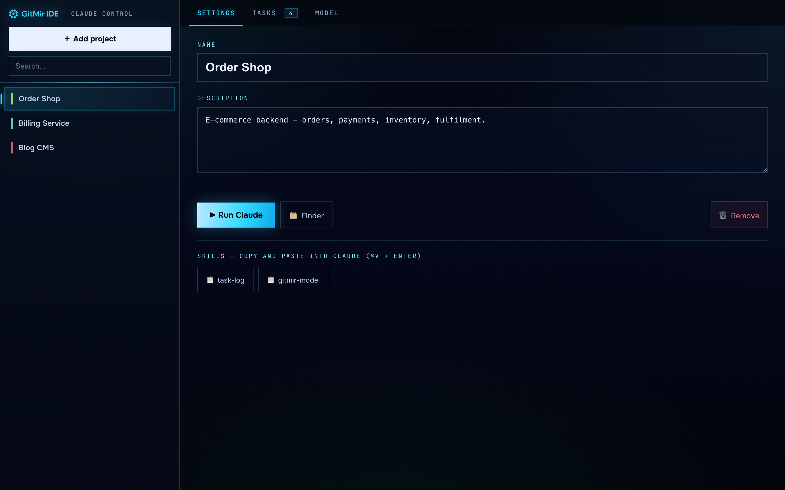
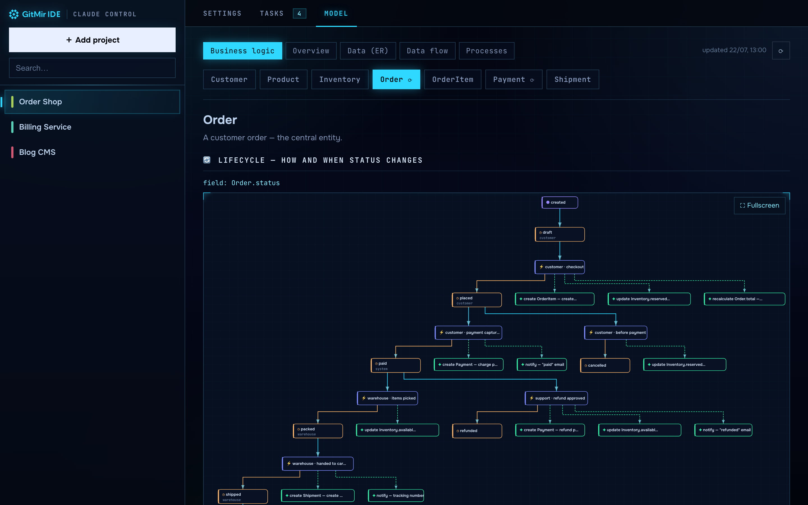
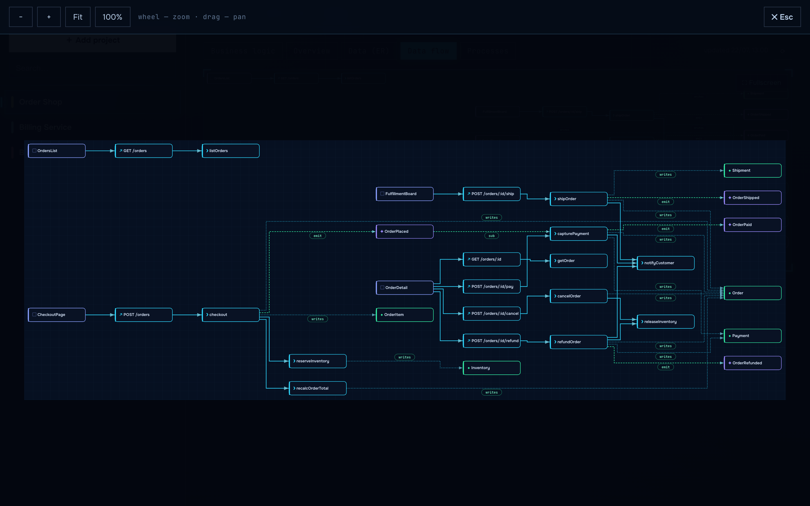
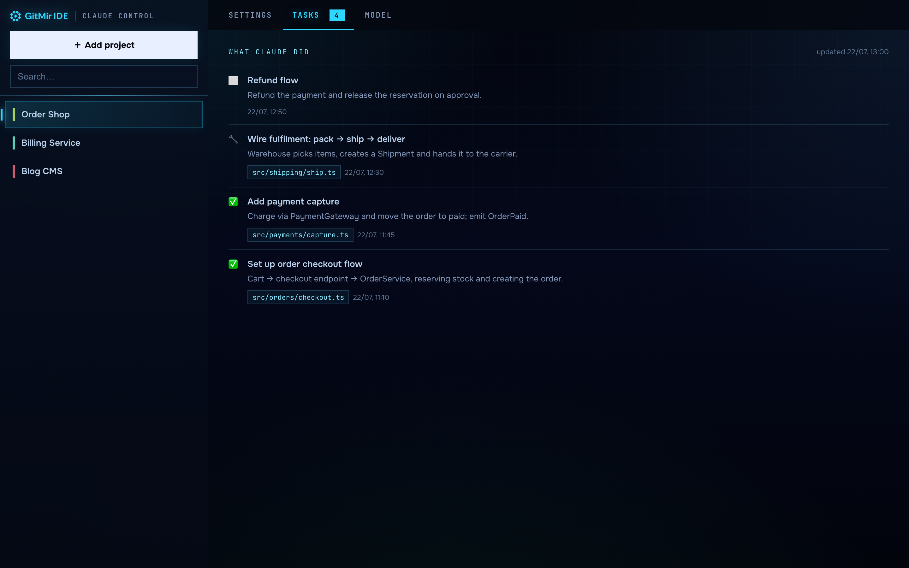
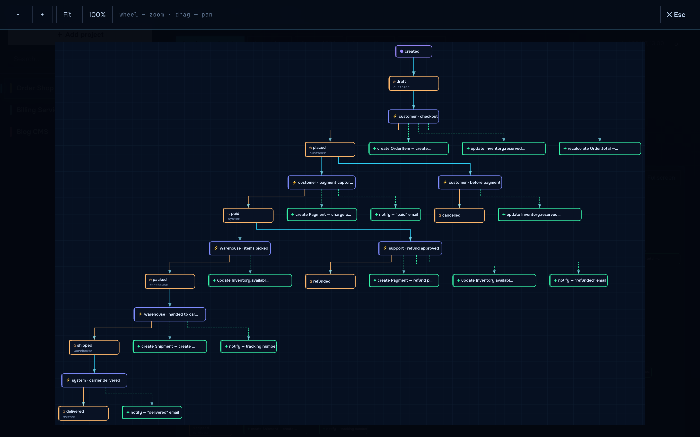
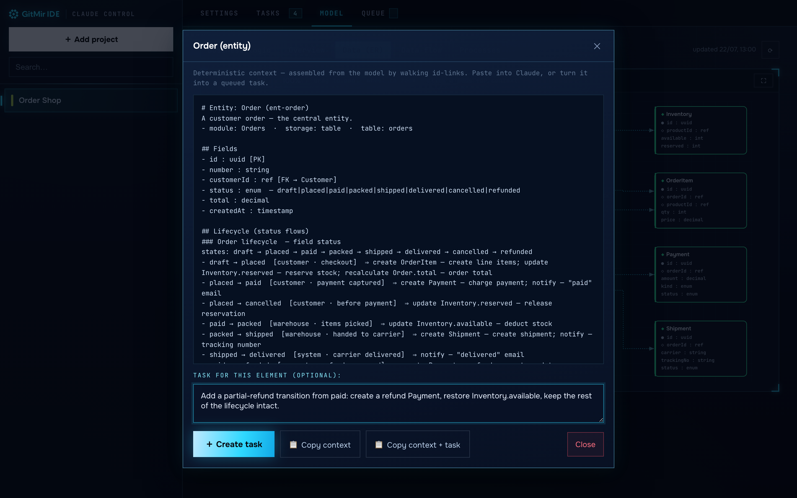
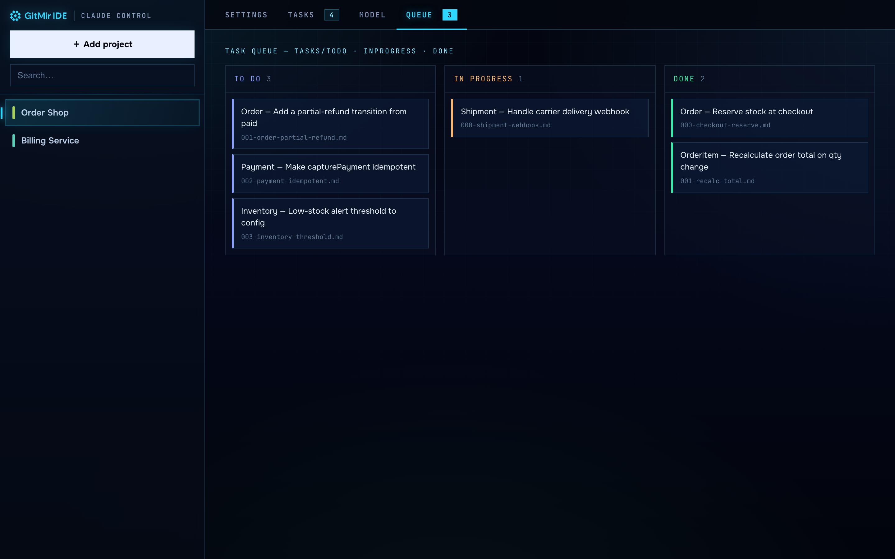

<div align="center">

# GITMIR Claude Control

**A local, single-file dashboard to run [Claude Code](https://www.anthropic.com/claude-code) across all your projects — with a per-project task log and a live business-logic model of each product.**

[](LICENSE)
[](https://nodejs.org)
[](#requirements)
[](#)
[](SECURITY.md)
[](SECURITY.md)
[](https://gitmir.com)

Launch Claude in any project with one click · copy reusable skills into your session · visualize your product's data, flows, processes and entity lifecycles — all in an offline, dependency-free HUD.

Built on the **GITMIR multidimensional model** — the living source-of-truth model behind **[gitmir.com](https://gitmir.com)**.

<br>


<sub>Pick a project → <b>▶ Run Claude</b> → copy the <code>gitmir-model</code> skill → open <b>Model</b> and see the product's business logic and data flows — laid out by <a href="https://github.com/kieler/elkjs">ELK</a> in the GITMIR HUD.</sub>

</div>

---

## Why we built it

At **GITMIR** we run Claude Code all day, across dozens of projects scattered over different folders and disks. Two things kept getting in the way — so we fixed them for ourselves, and now we use this every day.

**First, the launching.** `cd` into the right folder, start `claude`, repeat — and never quite remember where everything lives. So we put every project behind one screen: pick it, hit **▶ Run Claude**, done.

**Second — and this is the real one — losing the thread.** As AI writes more of the software, the code stops being something you *read* and becomes something you have to *trust*. You lose sight of what the product actually is: which entities exist, how an order moves from `placed` to `refunded`, what fires when a status changes. Our answer is a **model** — a living, multidimensional source of truth the repository keeps current, instead of code you re-read every time. This tool builds that model from your real code and draws it, so you can see a product's business logic and data flows at a glance — and so Claude keeps it up to date after every change.

We built it for ourselves. It turned out useful enough to share — **free and open source** under GPL-3.0. If something's missing, you find a bug, or you'd like to contribute, you're very welcome.

**Grab it:** clone and `node server.js` — see [Run](#run). Made in the [GITMIR](https://gitmir.com) lab.

## Your code never leaves your machine

This runs **entirely on your computer**. It launches Claude locally, builds the
model locally, and stores everything under your own project folders. **It makes no
network calls to our servers — none.** No account, no sign-in, no telemetry,
nothing uploaded. It works fully offline.

You don't have to take our word for it:

- **It's open source — read every line.** The whole tool is one `server.js` with
  **zero npm dependencies**; everything it needs (ELK, fonts) is vendored locally.
- **Run it air-gapped.** Pull the network cable and it still works.
- **Watch the traffic.** There is nothing outbound to watch.

The well-known cloud AI dev tools send your source and your tasks to their servers.
This doesn't — and that isn't a privacy policy you have to trust, it's the
architecture, and you can verify it yourself in a few minutes. For a team under an
NDA, that's the difference between "not allowed" and "fine."

See **[SECURITY.md](SECURITY.md)** for exactly what touches the network (your
machine only) and what never does.

## What it is

You keep dozens of projects in different folders and launch `claude` from each. **GITMIR Claude Control** is a local web dashboard that holds them all:

- **Left:** your project list (add any folder on any disk).
- **Right, per project:** three tabs — **Settings**, **Tasks**, **Model**.



- **Settings** — name, path, description, and one-click **▶ Run Claude** (opens a terminal in that folder and starts `claude`). Cross-platform: macOS Terminal, Windows `cmd`, Linux terminals. Below, one-click **Skills** you copy into your Claude session.
- **Tasks** — a live log of what Claude did in the project (`.claude/tasks.json`), driven by the `task-log` skill.
- **Model** — a visualization of the project's **`.gitmir/model/`**: **Business logic** (entity lifecycles), **Overview**, **Data (ER)**, **Data flow** and **Processes**. **Click any element** in a diagram to pull its exact context or turn it into a task.
- **Queue** — a board of the file-based task queue (`tasks/todo · inprogress · done`) that the `task-runner` skill works through.

It's **one Node file, no npm dependencies**. Everything it needs (ELK, fonts) is vendored locally, so it runs fully offline.

## Screenshots

| Business logic — entity lifecycle | Data flow |
|---|---|
| [](docs/img/03-model-business-logic.png) | [](docs/img/05-data-flow.png) |
| **Tasks — what Claude did** | **Order state machine (fullscreen)** |
| [](docs/img/02-tasks.png) | [](docs/img/04-order-lifecycle.png) |

## The multidimensional model — from the GITMIR lab

The `.gitmir/model/` is not just documentation. It is a **multidimensional
object-information model** of your product — a living blueprint of what the software
*is*, not the code itself. Ten linked dimensions, each a different lens on the same
product:

`modules` · `entities` · `serverUnits` · `serverFunctions` · `apiRoutes` ·
`frontendUnits` · `events` · `processes` · `statusFlows` · `reactions`

Every reference is a **stable id**, so the collections form one connected graph
rather than ten disconnected lists — a human and an AI can both read it at a glance
and act on it without re-reading the whole repository. The **Business logic** view
walks a single entity through its lifecycle: how and when its status changes, which
processes drive it, and what side effects fire.

This model — and the idea of a single, living **source of truth** for a codebase —
comes out of the **GITMIR lab**. It is the same information model that powers
[GitMir](https://gitmir.com), the control room for AI software development. This
repository is the open-source companion that builds that model locally (via the
`gitmir-model` skill) and renders it.

## Tasks from the schema

The model isn't just to look at — it's how you brief Claude. **Click any element**
in a Model diagram and the tool walks its id-links to assemble the *exact* context
for that thing: its fields, lifecycle, the functions that read/write it, the events
it fires, the processes and reactions it's part of, related entities. No LLM
guessing — pure, deterministic graph traversal.



From there, **📋 copy the context** into Claude, or **＋ create a task**. Tasks are
plain markdown files under `<project>/tasks/{todo,inprogress,done}/` — one file per
task, each already carrying its context. The **Queue** tab shows them as a board:



Then paste the **`task-runner`** skill into Claude: it works the queue one task at a
time, moving each file `todo → inprogress → done` as it goes (the board updates
live). Because every task ships with the right context, Claude executes it precisely.


<sub>Click an element → assemble context → create a task → watch it land in the queue.</sub>

## Requirements

- [Node.js](https://nodejs.org) 18+
- The Claude Code CLI (`claude`) installed and on your `PATH`
- macOS, Windows, or Linux

## Run

```bash
git clone https://github.com/gitmir-hello/gitmir-claude-control.git
cd gitmir-claude-control
node server.js
```

It starts on **http://localhost:4599** and opens your browser. You can also double-click **`start.command`** (macOS) or **`start.cmd`** (Windows).

Run it in your normal desktop session so the native folder picker and terminal launch work (macOS Terminal · Windows `cmd` · Linux terminals). Stop with `Ctrl+C`.

## Skills

Skills are reusable instructions you copy from the dashboard (**Settings → 📋 skill**) and paste into your Claude session (`⌘V`/`Ctrl+V` + Enter). They live in [`skills.json`](skills.json); add your own by pointing an entry at a `.md` file.

- **`task-log`** — Claude keeps a human-readable log of completed tasks in the project's `.claude/tasks.json`; the **Tasks** tab shows it live.
- **`gitmir-model`** — Claude builds/updates the project's **multidimensional object model** in `.gitmir/model/` from the real code. It also installs a standing rule into the project's `CLAUDE.md` so the model stays the product's living source of truth: consult it before working, update it after code changes.
- **`task-planner`** — break a goal into small, self-contained task files in `tasks/todo/`, each with the relevant model context.
- **`task-runner`** — execute the task queue one at a time, moving each file `todo → inprogress → done` and appending an outcome.

Run `gitmir-model` once per project (then re-run after changes — it's idempotent) and the **Model** tab lights up with data (ER), data-flow, process and entity-lifecycle diagrams.

## Design

The UI follows the **GITMIR "holo / HUD"** design language — deep-navy `#04060a`, electric cyan `#2fd8ff`, sharp technical plates with glowing corner brackets, `Onest` + `JetBrains Mono` typography. Diagram layout is computed by **ELK** and drawn as SVG.

## About GITMIR

**[GitMir](https://gitmir.com) is the control plane for AI development:** describe
what to build in plain language, run it on your own Claude Code over MCP, and see
exactly what changed — in code, business logic and data flows. Its landing is a
sci-fi *information model lab* — because the model is the point: one living
source of truth for your product instead of code you have to re-read every time.

- 🌐 Website — **[gitmir.com](https://gitmir.com)**
- 🚀 App — **[ide.gitmir.com](https://ide.gitmir.com)**
- ✉️ **hello@gitmir.com**

**GITMIR Claude Control** is a small open-source tool from the same lab — bringing
the GITMIR model and one-click Claude runs to your local machine.

## Third-party & credits

Bundled libraries and fonts are included under their own licenses — see [THIRD_PARTY.md](THIRD_PARTY.md). The GITMIR logo is a trademark of GITMIR.

## License

[GPL-3.0](LICENSE) © GITMIR
