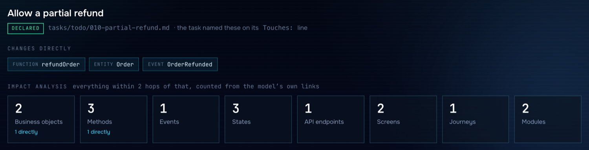
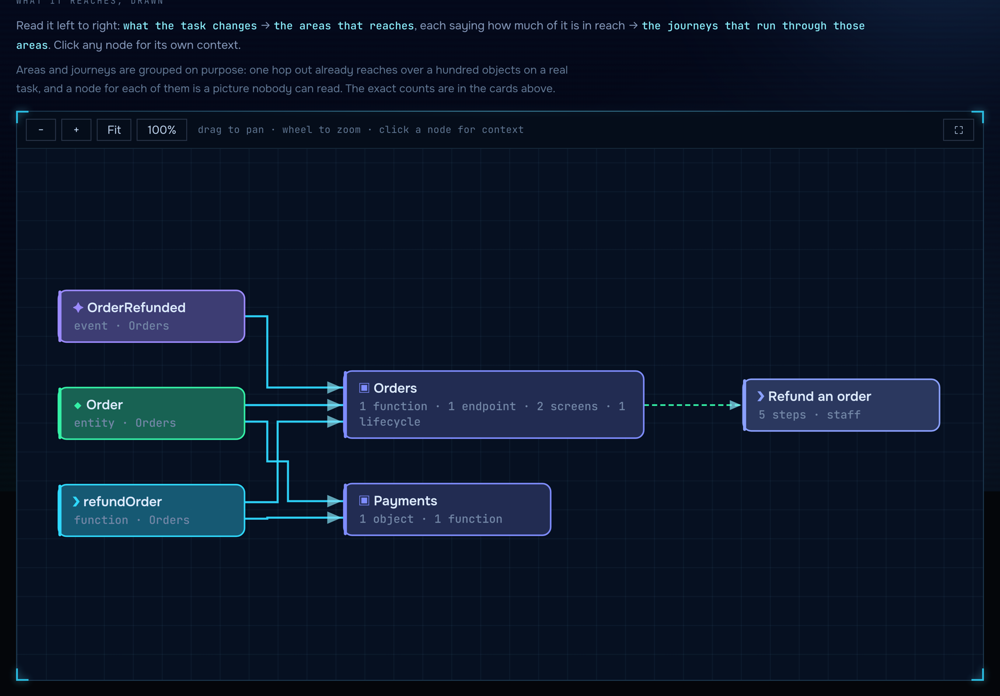
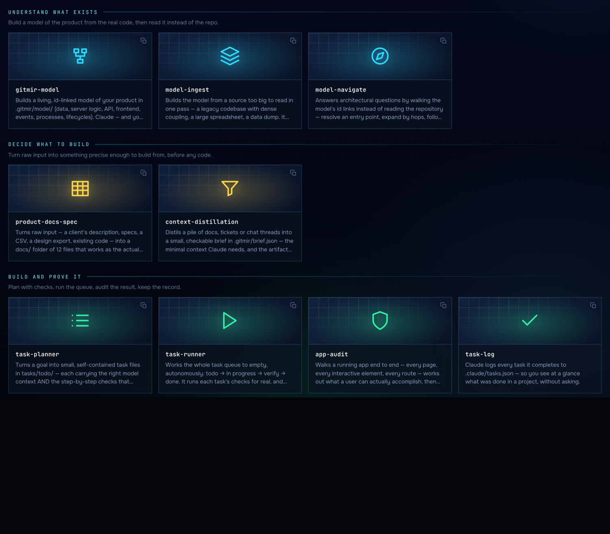
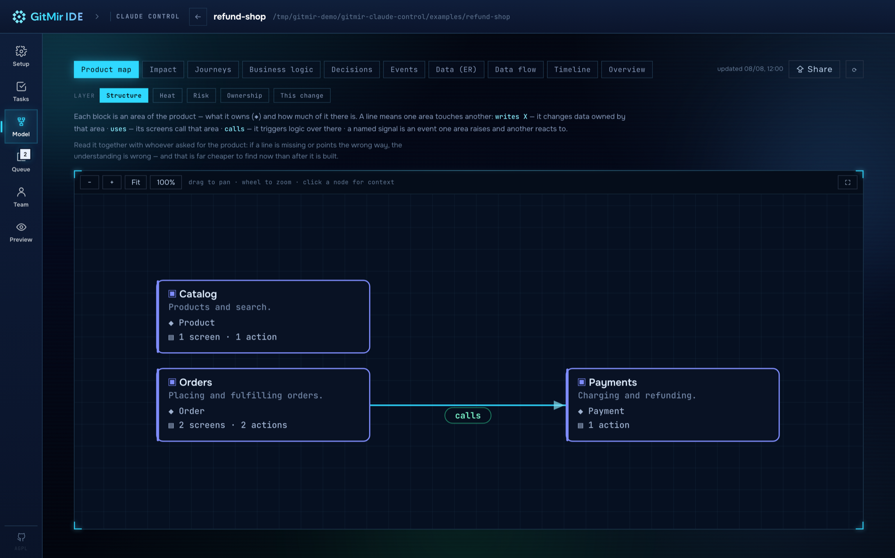

<div align="center">

# GITMIR Claude Control

**See what a change will reach — before you let the agent make it.**

[](LICENSE)
[](https://nodejs.org)
[](#requirements)
[](SECURITY.md)
[](SECURITY.md)
[](https://gitmir.com)

<br>


</div>

---

## The problem

Your agent can write the change. It cannot tell you what else depends on the code it is
about to touch, and neither can a diff — a diff shows files, not consequences.

So you approve on instinct. The refund function looked isolated; it turned out to sit on
the same lifecycle as payouts, and you found out in staging.

## What this gives you

A dashboard that reads your repository once and builds a model of the **product** — areas,
business objects, server functions, API endpoints, screens, events, processes, lifecycles —
linked by stable ids. Then it answers three questions your repo cannot.

### 1. What will this task change?



The task names the ids it will change. Everything within two hops is walked from the
model's own links — not declared by anyone, not guessed by an LLM.

`DECLARED` means the task said so on its `Touches:` line. If it didn't, the badge turns
amber and says the numbers came from what the task merely mentions — so you know how much
to trust them.

### 2. How much of the product does that reach — and why?

Risk is a **share of the product**, not a point score. 21 of 29 possible points is "most
of it" in a nine-module product and "a corner" in a ninety-module one, so the same change
does not get the same label in both.

Every component is on screen with its count and its weight. You can disagree with a
weight, change it, and see what moves. Two of the seven lines above are what usually
decides the call: **sensitive data reached** (money, credentials, personal data — marked
in the model, not inferred) and **user journeys affected** (someone walks through these;
breaking one is visible to them).

### 3. Where does it land?



Left to right: **what the task changes** → **the areas that reaches**, each stating how
much of it is in reach → **the journeys that run through those areas**. Click any node for
its own context.

Grouped on purpose: on a real task, one hop out reaches over a hundred objects, and a node
per object is a picture nobody reads.

**Approve this change** writes an `Approved:` line into the task file. It travels with the
task, and whoever runs it sees it — including Claude, which is told never to edit that line
and to say so out loud before running something unapproved.

---

## 60 seconds

```bash
git clone https://github.com/gitmir-hello/gitmir-claude-control.git
cd gitmir-claude-control
node server.ts
```

**http://localhost:4599** → add a project folder → **▶ Run Claude** → paste the
**`gitmir-model`** skill. Claude reads the repo, writes `.gitmir/model/`, and every view
above has something in it. No account, no build step, no runtime dependencies.

Want to look before pointing it at your own code? Add
[`examples/refund-shop`](examples/refund-shop) — an invented shop with a model and two
planned tasks. Every screenshot in this README is that project.

---

## Eleven skills, grouped by when you need them



Click a card, paste into Claude. They are plain markdown in [`skills/`](skills) — read them,
change them, keep your own.

| | |
|---|---|
| **Understand what exists** | `gitmir-model` builds the model from real code · `model-ingest` does it for a codebase too big to read in one pass · `model-navigate` answers architectural questions by walking ids instead of re-reading the repo |
| **Decide what to build** | `product-docs-spec` turns a client's description into a `docs/` folder precise enough to build from · `context-distillation` compresses a pile of tickets and threads into a brief that fits |
| **Build and prove it** | `task-planner` writes tasks that carry their own checks · `task-runner` works the queue to empty · `app-audit` walks the running app end to end · `task-log` keeps the record |
| **Work on code you inherited** | `legacy-maintenance` changes an old system without breaking what sits next to it · `stack-port` moves it to a new stack, with a parity ledger |

**→ [What each one does](docs/SKILLS.md)**

---

## Why "done" means something here

A specification is written by a person, from memory, about a system too large to hold in
one head. The checks then cover what that person happened to think of — and the agent
grades its own homework.

Here the model is read out of the code, the reach of a change is walked from it, **that
reach becomes the `## Verify` steps**, and a task moves to `done` only when they pass.

**→ [How it works](docs/HOW-IT-WORKS.md)**

---

## The same answers inside your editor

`mcp.ts` serves the model over [MCP](https://modelcontextprotocol.io), so Claude Code,
Cursor, or anything else that speaks it can ask what something is, what breaks if it
changes, what a task would touch, and queue or approve work — without leaving the editor.

```json
{ "mcpServers": { "gitmir": {
    "command": "node",
    "args": ["/path/to/gitmir-claude-control/mcp.ts", "--project", "/path/to/your/project"] } } }
```

Your editor starts it as a subprocess and talks over stdin/stdout. **No port, no network,
and the dashboard does not need to be running** — two programs, the same files, the same
arithmetic, so they cannot give you different answers. Every reply states how fresh the
model is, because there is no amber banner in someone else's editor.

See what your editor will see, before wiring one up:

```
node mcp-check.ts examples/refund-shop tools
node mcp-check.ts examples/refund-shop impact 010-partial-refund.md
```

**→ [The MCP server](docs/MCP.md)**

---

## The rest of the dashboard

| | |
|---|---|
| **Product map** | the product as areas a client would recognise, with layers for **Heat**, **Risk**, **Ownership** and **This change** |
| **Journeys · Business logic · Decisions · Events · Data** | the paths people walk, entity lifecycles, every branch and its condition, event chains, and where data moves |
| **Queue** | `todo → in progress → verify → done`, each card carrying its risk and its approval |
| **Timeline** | the product changing, in the order it changed |
| **Preview** | open any URL, click an element, get a prompt naming it and the files it probably lives in |



---

## The rules

**Your code never leaves your machine.** Claude runs locally, the model is built locally,
everything lives in your repo. **No telemetry, ever.** ([SECURITY.md](SECURITY.md))

**Team.** Solo is free forever. The **Team bridge** lets teammates run this same tool and
see your model, see which checks passed, and send you tasks that land in your
`tasks/todo/`. The server routes messages and stores no business logic. **$19/month per
builder, viewers free** — sharing a read-only map is free on any plan.
**→ [ide.gitmir.com](https://ide.gitmir.com)**

**Requirements.** [Node.js](https://nodejs.org) 22.18+ (it runs the TypeScript directly —
`node server.ts` is the whole build system), the `claude` CLI on your `PATH`, macOS ·
Windows · Linux. `dependencies` is empty and staying that way: ELK and the fonts are
vendored, so it works offline. Port 4599, or `GITMIR_PORT=4600 node server.ts`. Desktop
shortcut: `bash install-shortcut.command` (macOS) · `install-shortcut.cmd` (Windows).

**License.** Dual: **[AGPL-3.0](LICENSE)** — free, fork it, use it for paid work; distribute
a modified version as a service and your source goes AGPL too. Or a **[commercial
license](LICENSING.md)** for closed-source embedding or hosting — **hello@gitmir.com**.

---

<div align="center">

We built this for ourselves — we run Claude Code all day across dozens of projects.

**[Did it run on your machine?](https://github.com/gitmir-hello/gitmir-claude-control/discussions/1)**
There is no telemetry, so that thread is the only way we learn anything — especially
whether the model matched your product, and where it got it wrong.

🌐 **[gitmir.com](https://gitmir.com)** · 🚀 **[ide.gitmir.com](https://ide.gitmir.com)** · ✉️ **hello@gitmir.com**

<sub>© GITMIR · bundled libraries and fonts ship under their own licenses ([THIRD_PARTY.md](THIRD_PARTY.md)) · the GITMIR name and logo are trademarks</sub>

</div>
