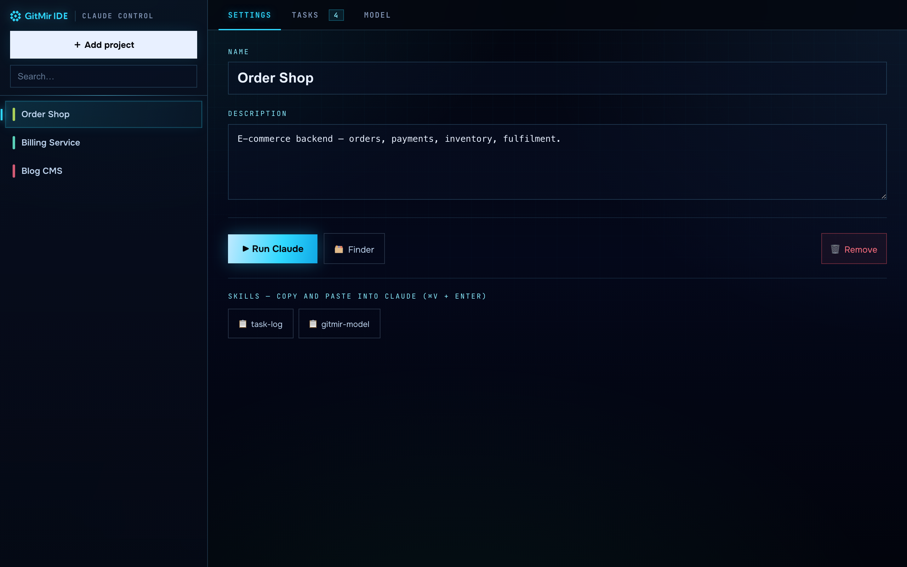
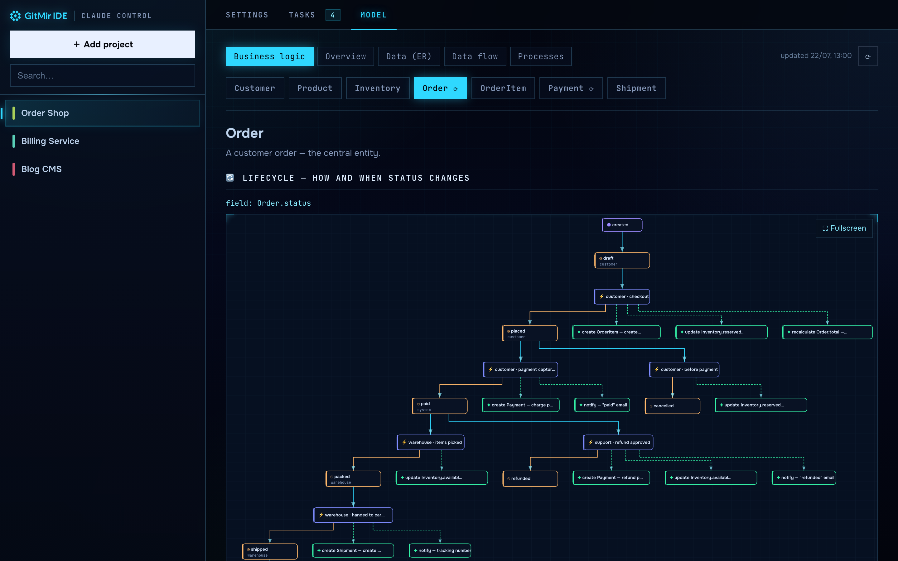
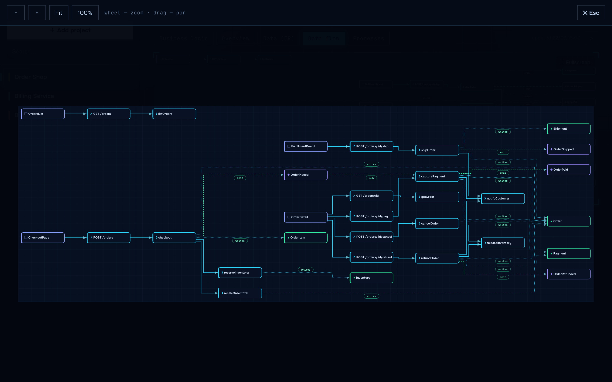
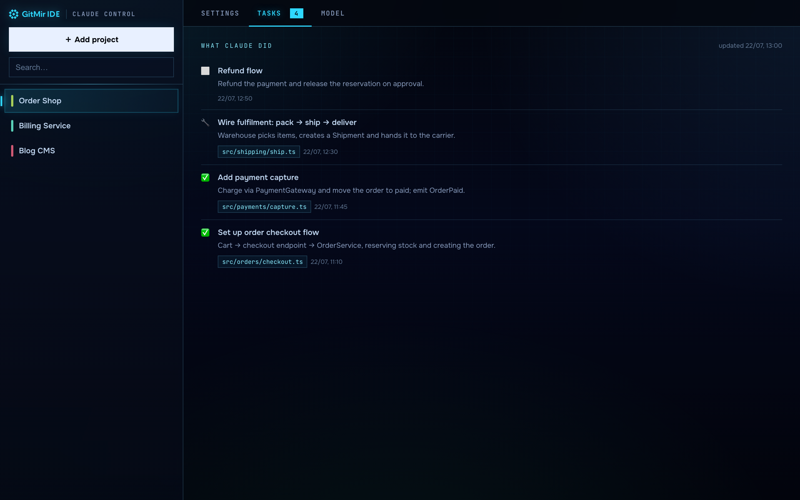
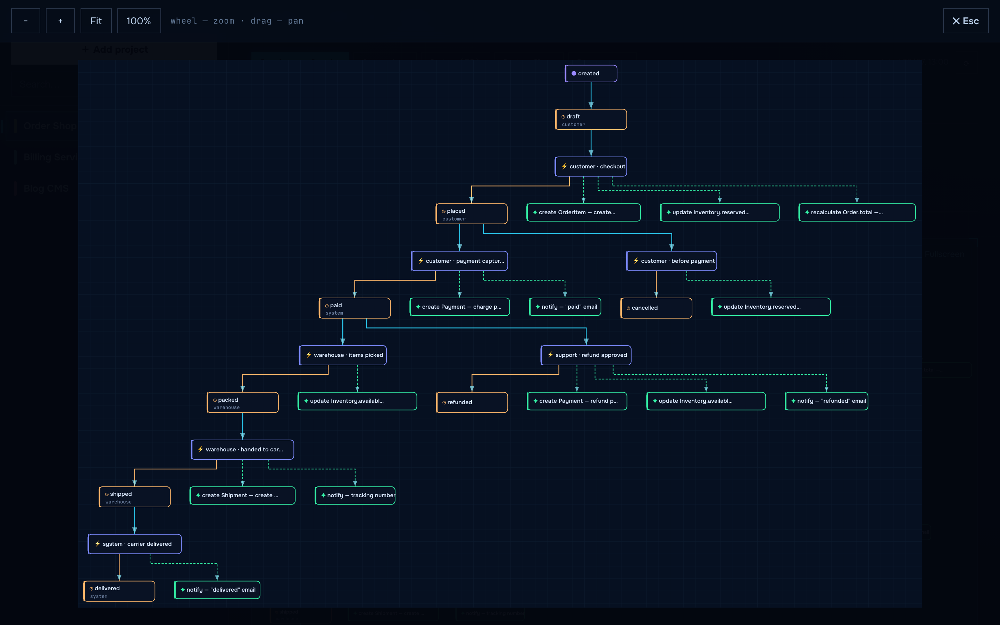
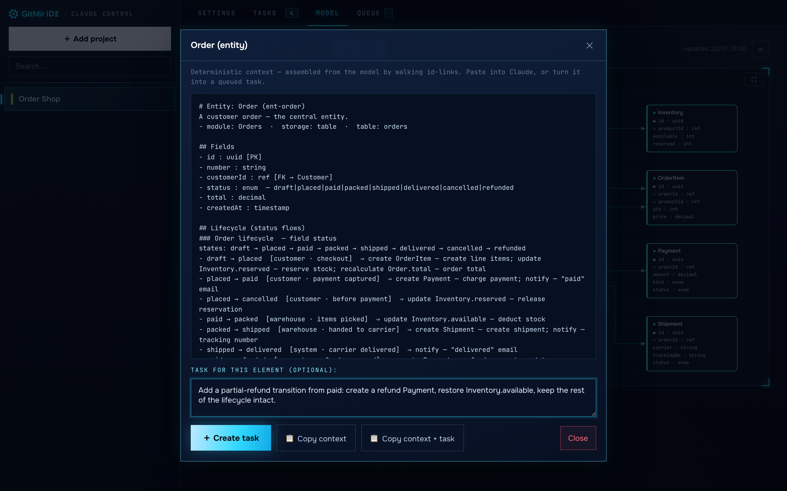
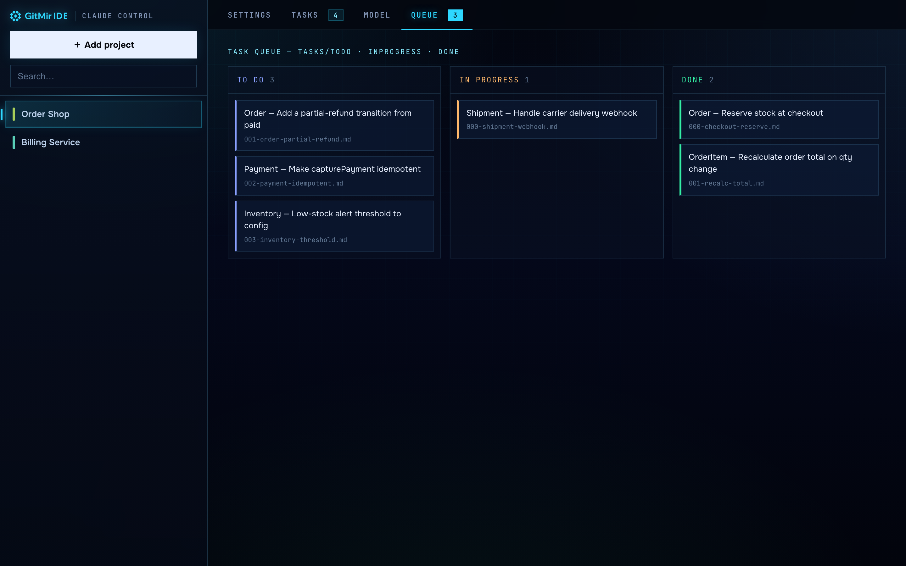
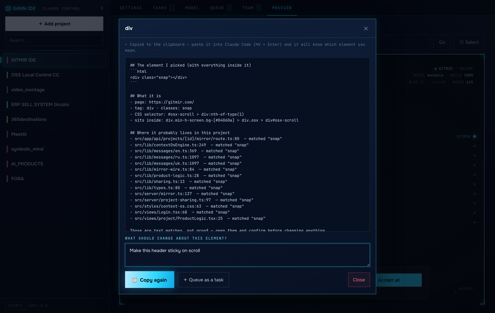

<div align="center">

# GITMIR Claude Control

**See what your product actually is — and hand your AI the exact slice of it.**

A local, single-file dashboard that runs [Claude Code](https://www.anthropic.com/claude-code) across all your projects, builds a living model of each one from the real code, and turns any piece of that model into a precisely-briefed task.

[](LICENSE)
[](LICENSING.md)
[](https://nodejs.org)
[](#requirements)
[](#)
[](SECURITY.md)
[](SECURITY.md)
[](https://gitmir.com)

<br>


<sub>Pick a project → <b>▶ Run Claude</b> → copy the <code>gitmir-model</code> skill → open <b>Model</b> and see the product's business logic and data flows — laid out by <a href="https://github.com/kieler/elkjs">ELK</a> in the GITMIR HUD.</sub>

</div>

---

## The problem

AI writes more of your code every month. Somewhere along the way the codebase stops
being something you *read* and becomes something you *trust* — and you lose the thread.

Which entities exist. How an order gets from `placed` to `refunded`. What fires when
that status changes. Which three services quietly read the field you're about to
rename. On a product big enough to matter, nobody holds that picture any more — so
every brief you write to the agent is a little vague, and every vague brief comes
back as code you didn't ask for.

The fix isn't a better prompt. It's a **model**: a living, structured description of
what the software *is*, that the repository keeps current — so you and your agent
both work from the same picture instead of re-reading the code every time.

## 60 seconds

```bash
git clone https://github.com/gitmir-hello/gitmir-claude-control.git
cd gitmir-claude-control
node server.js
```

Opens on **http://localhost:4599**. Add a project folder → **▶ Run Claude** → paste the
**`gitmir-model`** skill. Claude reads the repo and writes `.gitmir/model/`. The
**Model** tab lights up: entity lifecycles, ER, data flows, processes.

No account. No sign-in. No install beyond `git clone` — **zero npm dependencies**.

## What you get



- **All your projects on one screen.** Add any folder on any disk; launch `claude` in
  it with one click (macOS Terminal · Windows `cmd` · Linux terminals). No more `cd`
  archaeology across three drives.
- **Model** — the product's business logic drawn from your real code: entity
  lifecycles, ER, data flow, processes.
- **Tasks** — a live log of what Claude actually did in this project.
- **Queue** — the file-based task board (`todo · in progress · verify · done`) your agent works through — nothing reaches *done* until its checks actually pass.
- **Preview** — open any URL, click an element on the page, and get a prompt that names
  it and the files it probably lives in. No more "the second button under the pricing table".
- **Skills** — reusable instructions you copy into Claude with one click.

| Business logic — entity lifecycle | Data flow |
|---|---|
| [](docs/img/03-model-business-logic.png) | [](docs/img/05-data-flow.png) |
| **Tasks — what Claude did** | **Order state machine (fullscreen)** |
| [](docs/img/02-tasks.png) | [](docs/img/04-order-lifecycle.png) |

## The model: ten lenses, one graph

`.gitmir/model/` is not documentation that rots. It is a **multidimensional
object-information model** — ten linked collections, each a different lens on the
same product:

`modules` · `entities` · `serverUnits` · `serverFunctions` · `apiRoutes` ·
`frontendUnits` · `events` · `processes` · `statusFlows` · `reactions`

Every reference is a **stable id**, so these form one connected graph rather than ten
disconnected lists. That's what makes it useful to an agent: a task needs *one or two
dimensions*, not the whole repository. Cheap, targeted context instead of "read
everything and hope."

It's plain JSON in your repo. Diff it, review it in a PR, grep it. The `gitmir-model`
skill also installs a standing rule in the project's `CLAUDE.md`, so every future
session reads the model first and refreshes it after changing code — it stays true
without you remembering to update it.

## When the product is too big to fit

On a legacy system with thousands of cross-references, or a spreadsheet where the logic
lives in the columns, an agent asked to "map this" does not fail with an error. It reads
part of the source, summarises what it read, and hands you a model that looks complete.
The entities survive that treatment; **the links between things in different folders do
not** — and in a legacy system those links *are* the product.

So don't read it. **`model-ingest`** measures the source instead — file and line counts per
folder, or a computed census of a CSV's columns, fill rates and distinct values — then cuts
it into fragments that each fit in one context, orders them so that the things everything
else points at get built first, and writes **one queue task per fragment**. `task-runner`
works through them, each with a fresh context holding only its own slice, and the model
grows additively. A reference a fragment cannot resolve yet — fragment 7 calling a function
that fragment 24 will define — is recorded with its file:line evidence in
`.gitmir/ingest/unresolved.json`, never invented and never dropped. A final stitch pass
closes them and reports what stayed open.

That last part matters more than it sounds: **a model with twelve recorded unknowns is
trustworthy, and a model with twelve invented links is not — and they look identical.**

Then **`model-navigate`** is how a task uses it: resolve the entry id, expand by hops, and
follow the **inbound** references — the ones that answer "what breaks if I change this",
which is the question that gets forgotten. It states the path it walked, so you can see
which link it didn't follow. The code gets opened last, and only the files the model named.

For a normal-sized repo you don't need any of this — run `gitmir-model` and you're done.

## Brief your agent from the schema, not from memory

Click any element in a diagram and the tool walks its id-links to assemble the
**exact** context for that thing: its fields, its lifecycle, the functions that
read and write it, the events it fires, the processes it belongs to. No LLM
guessing — deterministic graph traversal.



From there: **📋 copy the context** into Claude, or **＋ create a task**. Tasks are
plain markdown under `<project>/tasks/{todo,inprogress,verify,done}/`, each already carrying
its slice of the model.



Paste the **`task-runner`** skill and Claude works the queue one task at a time, moving
each file `todo → in progress → verify → done`. Because every task ships with the right
context, it executes precisely instead of improvising — and because writing the code does
not finish a task, it then **runs that task's acceptance checks for real** and records what
each one actually did. All pass → *done*. One fails → the task stays unproven and the runner
writes the fix task itself, carrying the failed step and the observed result.


## Point at it instead of describing it



Some things are easier to point at than to write down. Open any URL in the **Preview** tab,
press **◎ Select**, and click the thing you want changed. You get a prompt — already on your
clipboard — carrying the element's own HTML with everything inside it, what it is (text, id,
`data-testid`, a shortest-unique CSS selector, what it sits inside), and **the files in your
project where it probably lives**, found by searching for its distinctive strings. When
nothing matches, it says so rather than naming a plausible file — a confident wrong file is
worse than none.

The page is fetched by your machine and served from it, so a site that refuses to be framed
still opens. It runs in its own origin, sandboxed away from the dashboard, and pointing it at
your own network is refused.

## Your code never leaves your machine

This runs **entirely on your computer**. It launches Claude locally, builds the model
locally, and writes everything into your own project folders. **It makes no network
calls to our servers — none.** No account, no telemetry, nothing uploaded. It works
fully offline.

Don't take our word for it:

- **Read every line.** The whole tool is one `server.js` with **zero npm
  dependencies** — everything it needs (ELK, fonts) is vendored locally. There is no
  transitive package doing something behind your back.
- **Run it air-gapped.** Pull the network cable; it still works.
- **Watch the traffic.** There's nothing outbound to watch.

The well-known cloud AI dev tools upload your source and your tasks to their servers.
This doesn't — and that's not a privacy policy you have to believe, it's the
architecture, and you can check it in five minutes. For a team under an NDA, that is
the difference between "not allowed" and "fine."

Details: **[SECURITY.md](SECURITY.md)**.

## Work as a team — without your code leaving anyone's machine

Everything above is free, forever, solo. The moment a second person needs to see what
you're building, turn on the **Team bridge**.

You keep building locally. Your teammates run this same open-source tool on **their**
machines and:

- **see the model you share** — the business logic of what you're building, rendered
  in their own local instance, so a PM can talk about the product without reading code;
- **send you tasks** that land straight in your local `tasks/todo/`, where your Claude
  picks them up.

The room is the **project**, so a team with five clients gets five separate channels,
not one noisy feed. The server does one job: it **routes messages between your
machines and stores no business logic** — nothing about your product sits on it, at
rest or otherwise. That's what makes this usable where a cloud IDE isn't.

This is the part that pays for the rest: **$19/month per builder**, viewers free and
unlimited — watching what a team builds never costs anything.

**→ [Create a team at ide.gitmir.com](https://ide.gitmir.com)**, open your project,
and the **Team bridge** panel gives you the address, the project id and your personal
key. Paste them into the **Team** tab here and you're connected.

## Skills

Copy from the dashboard (**Settings → 📋 skill**) and paste into your Claude session.
They live in [`skills.json`](skills.json) — point an entry at your own `.md` to add more.

| Skill | What it does |
|---|---|
| **`gitmir-model`** | Builds/updates the multidimensional model in `.gitmir/model/` from real code, and installs the standing rule that keeps it current. |
| **`model-ingest`** | For a source too big to read in one pass — a legacy system, a large spreadsheet. Measures it, cuts it into fragments that fit, and makes each one a queue task, so the model is built piece by piece instead of sampled. |
| **`model-navigate`** | Answers architectural questions by walking the model's id links instead of reading the repo — including the inbound links, which is what tells you what breaks. |
| **`product-docs-spec`** | At the start of a product: turns raw input — a client's description, specs, a dataset, a design export — into a `docs/` folder of 12 files that works as the actual build spec, written before any code. |
| **`context-distillation`** | Turns a pile of docs, tickets or a chat thread into a small brief with checkable acceptance criteria — the context, not the noise. |
| **`task-planner`** | Breaks a goal into small self-contained task files, each carrying the right slice of the model **and the step-by-step checks that prove it works**. |
| **`task-runner`** | Works the queue autonomously: `todo → in progress → verify → done`. It runs each task's checks for real, and when one fails it writes the fix task itself. |
| **`task-log`** | Keeps a human-readable log of what Claude completed, shown in the **Tasks** tab. |
| **`legacy-maintenance`** | Change an old codebase without breaking what's next to it: maps the blast radius from the model, then ships small reversible steps. |
| **`stack-port`** | Port a hand-written project to a new stack at full parity — the old app is the spec, a parity ledger stops anything being silently dropped. |

Run `gitmir-model` once per project (re-run any time — it's idempotent) and the whole
dashboard comes alive.

## Requirements

- [Node.js](https://nodejs.org) **18+** for the dashboard
- The Claude Code CLI (`claude`) on your `PATH`
- macOS, Windows or Linux
- **Node 22+** only if you use the Team bridge (it uses Node's built-in `WebSocket`,
  which is how this stays at zero dependencies) — on older Node the Team tab says so
  instead of failing silently

Run it in your normal desktop session so the folder picker and terminal launch work.
Stop with `Ctrl+C`. macOS users can double-click `start.command`; Windows, `start.cmd` —
though those run it in the foreground, so closing the terminal window stops the dashboard.

**Port.** 4599 by default. If it is taken, or two people share the machine, set
`GITMIR_PORT=4600 node server.js` — the dashboard says so plainly instead of throwing a
stack trace when the port is busy.

**Desktop shortcut (Windows).** Double-click `install-shortcut.cmd` once. It puts a
**GITMIR Claude Control** shortcut on your Desktop that starts the dashboard with no
console window and opens your browser. Stop it with `taskkill /IM node.exe /F`.

**Desktop shortcut (macOS).** Run `bash install-shortcut.command` once. It puts a **GITMIR
Claude Control** app on your Desktop that starts the dashboard *in the background* and
opens your browser — and if it is already running, simply opens the browser. The dashboard
then survives closing the browser, the launcher and any terminal; stop it with
`pkill -f 'node server.js'`. Logs: `~/Library/Logs/gitmir-claude-control.log`.

## Design

The UI follows the **GITMIR "holo / HUD"** language — deep navy `#04060a`, electric
cyan `#2fd8ff`, sharp technical plates with glowing corner brackets, `Onest` +
`JetBrains Mono`. Diagrams are laid out by **ELK** and drawn as SVG.

## About GITMIR

We built this for ourselves. We run Claude Code all day across dozens of projects,
and these two problems — launching, and losing the thread — were ours first. It
turned out useful enough to share, free and open source under AGPL-3.0.

**[GitMir](https://gitmir.com)** is the team layer on top of it: the accounts, the
teams and the bridge that connects your machines. Your code and your model stay where
they belong — on your machines.

- 🌐 **[gitmir.com](https://gitmir.com)** · 🚀 **[ide.gitmir.com](https://ide.gitmir.com)** · ✉️ **hello@gitmir.com**

## Tell us if it worked

There's no telemetry in this tool and there never will be — which means the only way we
learn anything is if you say something. **[Did it run on your
machine?](https://github.com/gitmir-hello/gitmir-claude-control/discussions/1)** is the
thread for it: whether it started, and — the part we most want to hear — whether the model
it built actually matched your product, and where it got it wrong.

Issues and pull requests are welcome too — if something's missing or broken, tell us.

## Third-party & credits

Bundled libraries and fonts ship under their own licenses — see
[THIRD_PARTY.md](THIRD_PARTY.md). The GITMIR logo is a trademark of GITMIR.

## License

**Dual-licensed** — pick the one that fits you:

- **[AGPL-3.0](LICENSE)** (free, OSI-approved open source). Run it, read it, fork it.
  If you distribute it or run a *modified* version as a service for other people, your
  version's source has to be available under the AGPL too. Using it on your own machine
  for your own work — including paid work — costs nothing and never will.
- **[Commercial license](LICENSING.md)** — for organisations whose policy forbids AGPL,
  for embedding this in a closed-source product, or for offering it as a hosted service
  with your changes kept private. Also the route to a signed agreement, warranty or
  support. Write to **hello@gitmir.com**.

Details and the reasoning: **[LICENSING.md](LICENSING.md)**.

© GITMIR. The GITMIR name and logo are trademarks and are not covered by either license.
